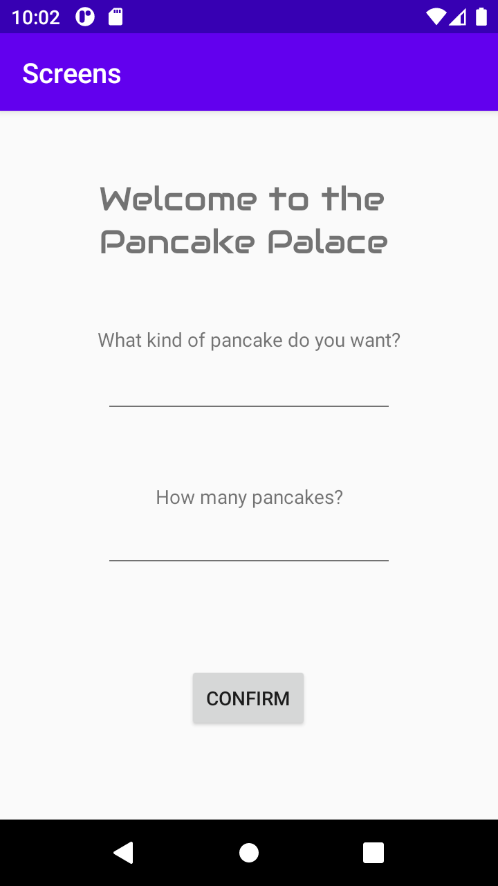

**Jag började med att skapa en extra tom activity som jag kallade second activity. 
inom main activity la jag till en knapp som visade andra sidan second activity, och 
jag skapade även lite text så att det går att särskillja sidorna från varandra. Jag 
använde sedan intents och extras för att lägga information i main activity och sedan 
skicka och visa upp dem i second activity, Skapade text edits i main activity vars 
input sedan skrivs ut i second activity. Ändrade även på texten i appen så att det 
skulle verka mer som att man handlar pankaror. Slutligen går det även att gå tillbaka 
till första activity från den andra eftersom jag satte main som second activity's 
"parent." Slutligen ändrade jag på storleken och fonten av min text tillsammans med 
små designmodifieringar.**
